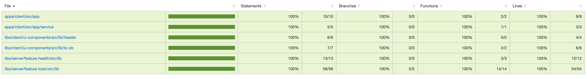

# Quantalys To-Do

## Backend - `server`

- NestJS 9
- REST API with Swagger documentation
- TypeORM for support of various database varieties

## Frontend - `client`

- Angular 16
- Stateless UI

## Testing

- Jest for backend unit testing
- Jest for Angular unit tests
- \> 90% code coverage

## Run Locally

Clone the project

```bash
  git clone <url>
```

Go to the project directory

```bash
  cd quantalys-kata-[...]
```

Install dependencies

```bash
  npm install
```

Start All application

```bash
  npx nx run-many --target=serve --all
```

Or

```bash
  npm start
```

Start back-end application

```bash
  npm run start:server
```

Start front application

```bash
  npm run start:client
```

## Running Tests

To run all tests, run the following command

```bash
  npx nx run-many --target=test --all --codeCoverage
```

Or

```bash
  npm run jest:coverage
```

Actual coverage



## Implement Kata steps

### Using api back


### Clean project by removing not-used npm package

### The project present a problem in performance

- improve performance by a fix the __AppComponent__

### Implement feature todo-list

- Table to show all todos, 5 items per page
- Todo title must be displayed in Uppercase
- Row with completed todo has color Green 18AF48
- Row with in-completed todo has color Orange FF4D00
- In the table it's possible to update todo to completed state using checkbox
- In the table it's possible to delete todo using click in garbage icon

### Implement feature add todo

### Implement feature edit todo

### Add DockerFile using nginx

### Change icon for front-end application using icon in directory '/images/favicon.ico'


### Update angular to last stable version

__NB: Keep height rate level to functional test using jest.__

## Nice to have

- Attractive design
- Responsive design
